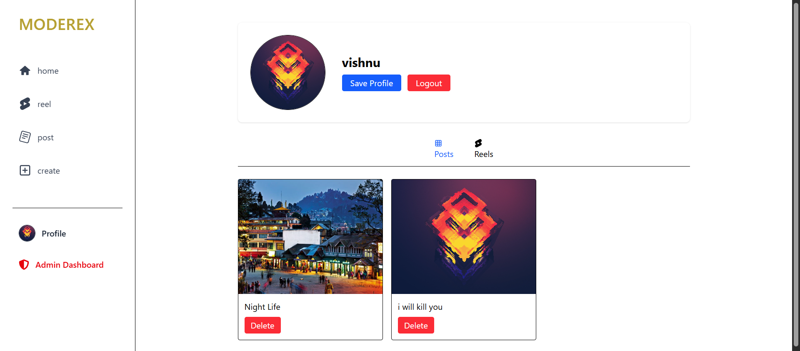
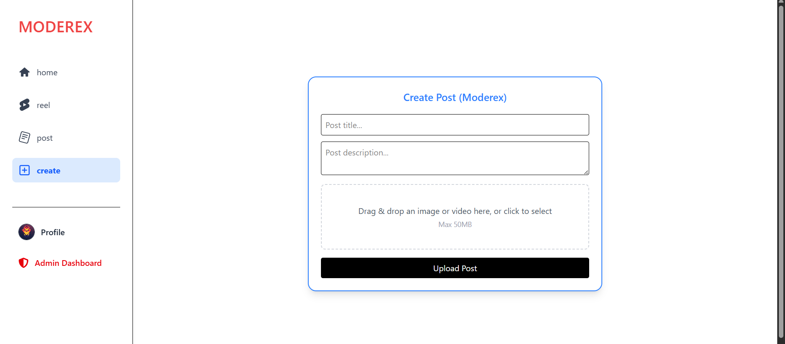
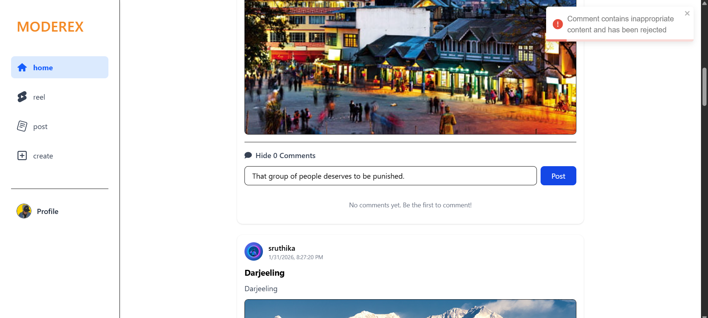
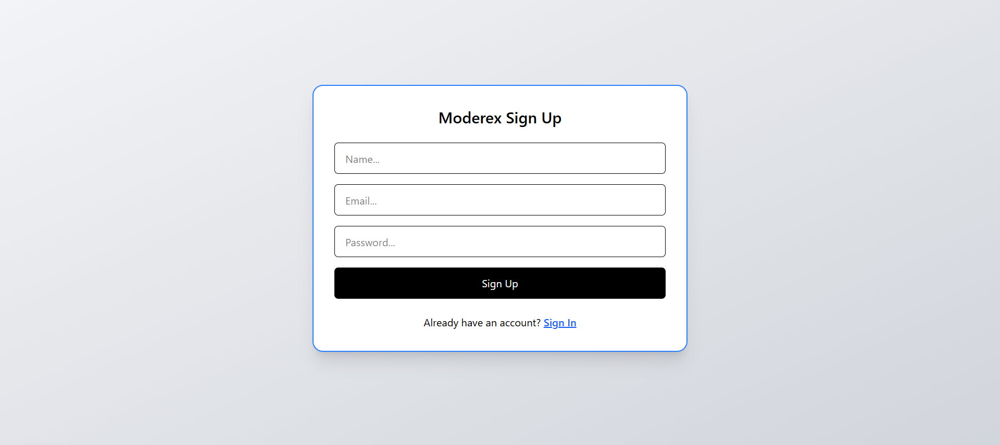
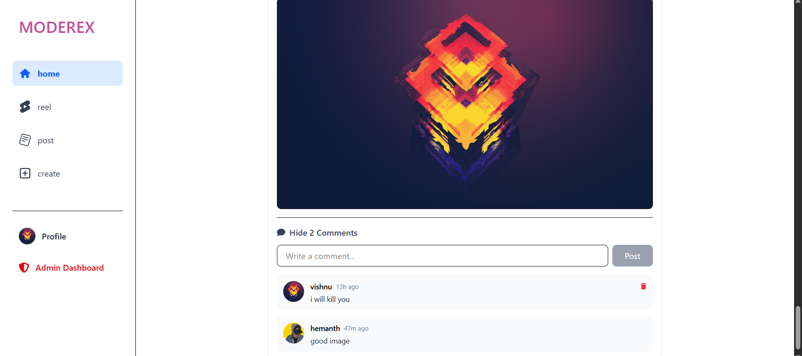

# Moderex - AI-Powered Content Moderation Platform

Moderex is a social media platform with integrated AI-powered content moderation system that automatically detects and manages inappropriate content using OpenAI's Moderation API.

## Features

### AI Content Moderation
Automatic detection of hate speech, self-harm, sexual content, violence, and spam using OpenAI's Moderation API.

### User Profile

User Profile page to manage profile details, view posts, and perform quick actions like save and logout.

### Real-time Flagging

Inappropriate comments are flagged instantly for review, with severe violations auto-rejected.

### Admin Dashboard

Comprehensive dashboard for reviewing and managing flagged content, with statistics and filtering options.

### User Authentication

Secure login and registration system with JWT tokens and password hashing.

### Post Management

Create, view, and interact with posts and reels, including image and video uploads via Cloudinary.

### Comment System

Interactive commenting with built-in moderation to maintain a safe community environment.

### Responsive Design
Modern UI built with React and Tailwind CSS, optimized for all device sizes.

## Tech Stack

### Frontend
- **React 19** - Modern React with hooks and functional components
- **Vite** - Fast build tool and development server
- **React Router** - Client-side routing
- **Tailwind CSS** - Utility-first CSS framework
- **Axios** - HTTP client for API requests
- **Framer Motion** - Animation library
- **React Toastify** - Notification system

### Backend
- **Node.js** - JavaScript runtime
- **Express.js** - Web framework
- **MongoDB** - NoSQL database
- **Mongoose** - MongoDB object modeling
- **JWT** - Authentication tokens
- **Bcrypt** - Password hashing
- **OpenAI API** - Content moderation
- **Cloudinary** - Image/video hosting
- **Multer** - File upload handling

## Getting Started

### Prerequisites
- Node.js (v16 or higher)
- MongoDB (local or cloud instance)
- OpenAI API key

### Installation

1. **Clone the repository**
   ```bash
   git clone <repository-url>
   cd Moderex
   ```

2. **Backend Setup**
   ```bash
   cd backend
   npm install
   ```

   Create a `.env` file in the backend directory:
   ```env
   PORT=3000
   MONGODB_URI=mongodb://localhost:27017/moderex
   JWT_SECRET=your-jwt-secret
   OPENAI_API_KEY=your-openai-api-key
   CLOUDINARY_CLOUD_NAME=your-cloudinary-name
   CLOUDINARY_API_KEY=your-cloudinary-api-key
   CLOUDINARY_API_SECRET=your-cloudinary-api-secret
   ```

   Start the backend server:
   ```bash
   npm run dev
   ```

3. **Frontend Setup**
   ```bash
   cd frontend
   npm install
   npm run dev
   ```

4. **Access the Application**
   - Frontend: http://localhost:5173
   - Backend: http://localhost:3000

## Usage

### For Users
- **Register/Login**: Create an account or log in
- **Create Posts**: Share images, videos, or text posts
- **Interact**: Like, comment, and engage with content
- **Profile**: Manage your profile and view your posts

### For Admins
- **Admin Dashboard**: Access via sidebar (admin users only)
- **Review Flagged Content**: Approve or reject flagged comments
- **View Statistics**: Monitor moderation metrics
- **Manage Users**: View and manage user accounts

## API Documentation

### Authentication
- `POST /api/v1/auth/register` - User registration
- `POST /api/v1/auth/login` - User login

### Posts
- `GET /api/v1/posts` - Get all posts
- `POST /api/v1/posts` - Create new post
- `POST /api/v1/posts/:id/comment` - Add comment to post

### Admin
- `GET /api/v1/admin/flagged` - Get flagged content
- `POST /api/v1/admin/flagged/:id/review` - Review flagged content
- `GET /api/v1/admin/stats` - Get moderation statistics

## Moderation System

The AI moderation system automatically analyzes all comments and flags inappropriate content. Categories include:
- Hate speech
- Self-harm content
- Sexual content
- Violence
- Spam

Severe violations are auto-rejected, while others are flagged for admin review.

## Development

### Available Scripts

**Frontend:**
```bash
npm run dev      # Start development server
npm run build    # Build for production
npm run preview  # Preview production build
npm run lint     # Run ESLint
```

**Backend:**
```bash
npm run dev      # Start with nodemon
npm start        # Start production server
```

### Project Structure

```
Moderex/
├── backend/
│   ├── src/
│   │   ├── controllers/
│   │   ├── models/
│   │   ├── routes/
│   │   ├── services/
│   │   └── middlewares/
│   ├── uploads/
│   └── package.json
├── frontend/
│   ├── src/
│   │   ├── components/
│   │   ├── pages/
│   │   ├── context/
│   │   └── hooks/
│   ├── public/
│   └── package.json
└── MODERATION_SETUP.md
```

